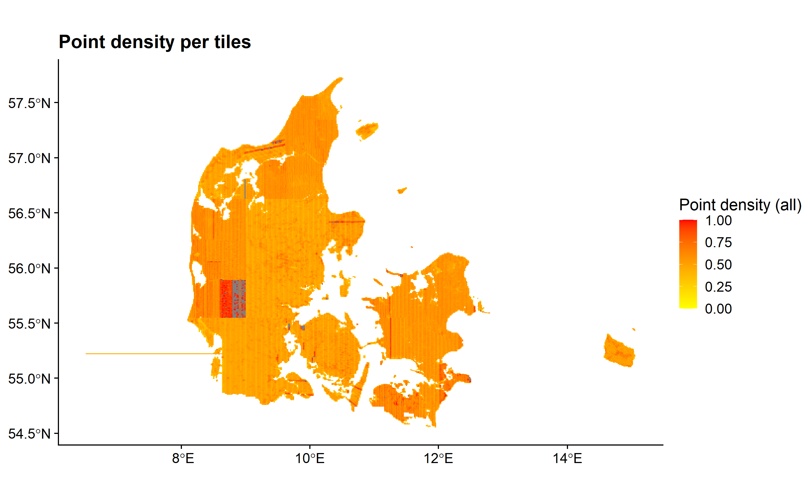

## Quality check of Danish country-wide ALS datasets

This report aim is to quality check the different danish country-wide ALS datasets on the AU server. The following directories were revised:

| directory name | expected flight campaign | adjusted GPS time |
| --- |:---:| ---:|  
| KMS2007 | 2006/2007 | not available (trajectory files) | 
| DHM2007 | 2006/2007 | not available (trajectory files) | 
| GST_2014 | 2014/2015 | available |
| DHM2015 | 2014/2015 | available |
| 2015_2018 | 2018+ | available |
| 2019 | 2018+ | available |

## KMS2007

The metadata extraction was successful, no corrupt files occurred in the dataset. The issue with the directory is that the downloaded files did not cover the whole of the Denmark (big blocks are missing). Furthermore one tile (6123_485) has an outlier. The header file of the las files contain limited information: no adjusted GPStime, no georeferencing information possible to retrieve. However linking the tiles to epgs:25832 (ETR89 UTM 32 N based on the GRS80 spheroid) gives the correct geographic location. The data acquisition times are possible to retrieve from the trajectory data (TODO). The las files were extracted with either using TerraScan or CPS/RTW LAS Lib v1.08.

Based on visual exploration of random tiles the data is a first-last return LiDAR data and the point density is around 0.5 points/m^2. 

Point density map           |  Point density histogram
:-------------------------:|:-------------------------:
  |  

## DHM2007

The metadata extraction was successful, no corrupt files occurred in the dataset. The directory contains all the tiles across Denmark. One tile (6123_485) has an outlier. The header file of the las files contain limited information: no adjusted GPStime, no georeferencing information possible to retrieve. However linking the tiles to epgs:25832 (ETR89 UTM 32 N based on the GRS80 spheroid) gives the correct geographic location. The data acquisition times possible to retrieve from the trajectory data (TODO). The las files were extracted with either using TerraScan or CPS/RTW LAS Lib v1.08. 

Based on visual exploration of random tiles the data is a first-last return LiDAR data and the point density is around 0.5 points/m^2. 

Point density map           |  Point density histogram
:-------------------------:|:-------------------------:
  |   

## GST_2014

The metadata extraction found 99 incorrect files with incorrect header information with the error message as follows:

"ERROR: header size is 0 but should be at least 227
ERROR: cannot open lasreaderlas with file name 'xxx\PUNKTSKY_1km_6116_483.laz'
Error: LASlib internal error. See message above."

The geographic information is stored as epgs code within the laz files (which is expected since las v.1.3 is used) however 6 tiles do not contain geographic information, but linking them to epgs:25832 (ETR89 UTM 32 N based on the GRS80 spheroid) gives the correct geographic location. The datasets were largely extracted with PDAL 1.3.0. Main issue with the dataset is that the minimum GPS time (converted into day-month-year) shows that it contains LiDAR data from the (previous) 2006/2007 ALS campaign (in the case of 11720 tiles). (TODO: needs to be checked how this points located within the 1 km x 1 km area e.g. only water point and ground points or also vegetation points, whether these tiles are not re-measured tiles etc.)

Oldest            |  Most recent
:-------------------------:|:-------------------------:
  |  
  |  

The dataset is a discrete-return LiDAR data with 4-5 recorded returns. The estimated mean point density calculated for all returns is 8 pt/m^2. 

Point density map           |  Point density histogram
:-------------------------:|:-------------------------:
  |  

## DHM2015

## 2015_2018

The metadata extraction found 8 incorrect files however no error message was retrieved regarding these files (TODO: needs to be checked manually). 

The geographic information is mainly stored as epgs code within the laz files however 276 tiles do not contain geographic information, but linking them to epgs:25832 (ETR89 UTM 32 N based on the GRS80 spheroid) gives the correct geographic location. The datasets were largely extracted with PDAL 1.3.0 and 1.5.0. Some files were extracted using TerraScan and one with CPS/RTW LAS Lib v1.08. The dataset contains LiDAR data from all three flight campaigns. The 2014/2015 LiDAR dataset were updated with the more recently measured dataset(s). Based on the minimum GPS time 9348 tiles contain data from 2006/2007 flight campaign as well as the 2018 measured region constains some tiles which were measured in 2015. 

Oldest            |  Most recent
:-------------------------:|:-------------------------:
  |  
  |  

The most recently measured LiDAR dataset is a fullwaveform ALS data. The estimated mean point density calculated for all returns is 10 pt/m^2.

Point density map           |  Point density histogram
:-------------------------:|:-------------------------:
  |  

## 2019

The metadata extraction found 92 incorrect files however no error message were retrieved regarding these files (TODO: needs to be checked manually). 

The geographic information is mainly stored as wkt within the laz files however 11 tiles do not contain geographic information, but linking them to epgs:25832 (ETR89 UTM 32 N based on the GRS80 spheroid) gives the correct geographic location. The files were extracted using various software solutions: CPD/RTW LAS Lib v1.08, las2las (different versions), PDAL 1.3.0, 1.8.0 and TerraScan. Based on the minimum GPS time 7646 tiles contain data from 2006/2007 flight campaign as well as the regions measured in 2018, 2019 is still contains some files from the 2014/2015 flight campaign. 

Oldest            |  Most recent
:-------------------------:|:-------------------------:
  |  
  |  

The most recently measured LiDAR dataset is a fullwaveform ALS data. The estimated mean point density calculated for all returns is 12 pt/m^2.

Point density map           |  Point density histogram
:-------------------------:|:-------------------------:
  |  

## Conclusion

Minimum requirement for data usability: 
- Avoid mixing the tiles from different flight campaigns. Storing the different flight campaigns separately. (TODO: separate the point clouds and re-organize them according to flight campaigns) 

Maximum requirements/wishes:
- Standardized way of saving geographical information
- Report about the overall vertical and horizontal accuracy
- Report about how the classification have been carried out
- Used scanners for the flight campaigns
- Access to the trajectory files