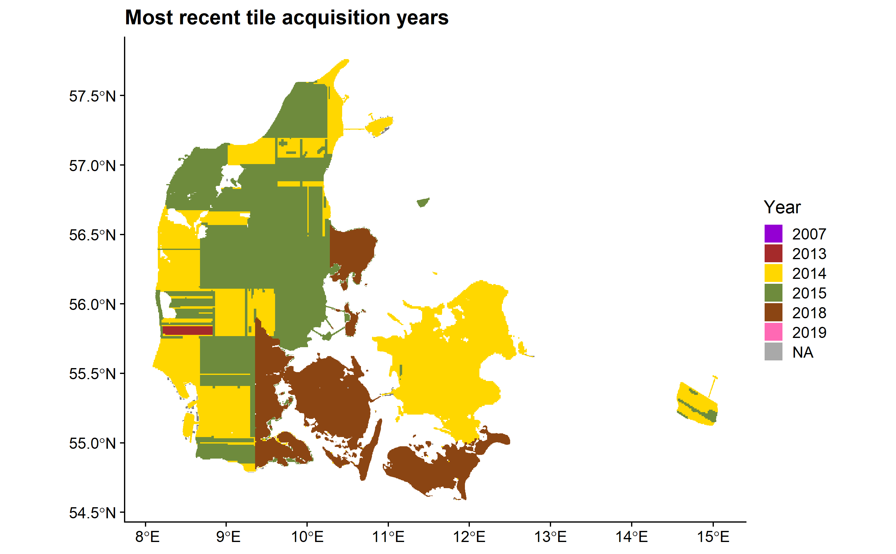

## Quality check of Danish country-wide ALS datesets

This report aim to quality check the different danish country-wide ALS datasets on the AU server. The following directories were revised:

| directory name | expected flight campaign | adjusted GPS time |
| --- |:---:| ---:|  
| KMS2007 | 2006/2007 | not available (trajectory files) | 
| DHM2007 | 2006/2007 | not available (trajectory files) | 
| GST_2014 | 2014/2015 | available |
| DHM2015 | 2014/2015 | available |
| 2015_2018 | 2018+ | available |
| 2019 | 2018+ | available |

## KMS2007

The metadata extraction was succesful, no corrupted files occured in the dataset. The problem with the directory is that the downloaded files did not cover the whole of the Denmark big blocks are missing. Furthermore one tile (6123_485) has an outlier. The header file of the las file which saved on las v.1.0 contains limited information: no adjusted GPStime, no georeferencing information possible to retrieve. However linking the tiles to epgs:25832 (ETR89 UTM 32 N based on the GRS80 spheroid) gives the correct geographic location. The data acquisition times possible to retrieve from the trajectory data (TODO). The las files were extracted with either using TerraScan or CPS/RTW LAS Lib v1.08.

Based on visual exploration of random tiles the data was measured with a first-last return LiDAR data and the point density is between 0-1 points/m2. 

## DHM2007

The metadata extraction was succesful, no corrupted files occured in the dataset. The directory contains all the tiles across Denmark. One tile (6123_485) has an outlier. The header file of the las file which saved on las v.1.0 contains limited information: no adjusted GPStime, no georeferencing information possible to retrieve. However linking the tiles to epgs:25832 (ETR89 UTM 32 N based on the GRS80 spheroid) gives the correct geographic location. The data acquisition times possible to retrieve from the trajectory data (TODO). The las files were extracted with either using TerraScan or CPS/RTW LAS Lib v1.08.The las files were extracted with either using TerraScan or CPS/RTW LAS Lib v1.08.The las files were extracted with either using TerraScan or CPS/RTW LAS Lib v1.08.The las files were extracted with either using TerraScan or CPS/RTW LAS Lib v1.08.

Based on visual exploration of random tiles the data was measured with a first-last return LiDAR data and the point density is between 0-1 points/m2. 

## GST_2014

The metadata extraction found 99 incorrect files with incorrect header information with the error message as follows:

"ERROR: header size is 0 but should be at least 227
ERROR: cannot open lasreaderlas with file name 'xxx\PUNKTSKY_1km_6116_483.laz'
Error: LASlib internal error. See message above."

The geographic information is stored as epgs code within the laz files (which is expected since las v.1.3 is used) however 6 tiles do not contain geographic information, but linking them to epgs:25832 (ETR89 UTM 32 N based on the GRS80 spheroid) gives the correct geographic location. The datasets were largely extracted with PDAL 1.3.0. Main issue is that during the extraction of the minimum GPS time (converted into day-month-year) still contains datasets from 2006/2007 ALS campaign (the minimum GPS time identifies 11720 tile). (TODO: needs to be checked what are this points e.g. only water point and ground points or also vegetation points , whether this are not re-mesured tiles etc.)

The dataset is a discrete return LiDAR data where 5 returns were recorded. The point density is between 0-50 points/m2. 

## DHM2015

## 2015_2018

The metadata extraction found 8 incorrect files however no error message were retrieved regarding these files. 

The geographic information is mainly stored as epgs code within the laz files however 276 tiles do not contain geographic information, but linking them to epgs:25832 (ETR89 UTM 32 N based on the GRS80 spheroid) gives the correc geographic location. The datasets were largely extracted with PDAL 1.3.0 and 1.5.0. Some files were extracted using TerraScan and one with CPS/RTW LAS Lib v1.08. The dataset contains LiDAR data from all three flight campaign. The storage technique was to update the 2014/2015 dataset in locations where new LiDAR data is available (until 2018 when the data was downloaded). So in the end one region is measured in 2018 and this is pusblished together with 2014/2015 dataset. Based on the minimum GPS time also 9348 tiles is still contains data from 2006/2007 and also the 2018 measured region some tiles measured in 2015 (13104 tiles). 

Oldest            |  Most recent
:-------------------------:|:-------------------------:
  |  
  |  

The most recently measured LiDAR dataset is fullwaveform ALS data. The point density is between 0-50 points/m2. 

## 2019